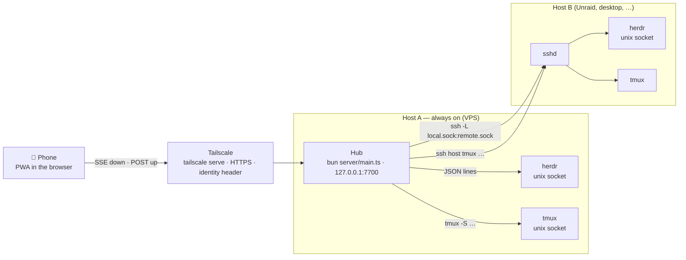
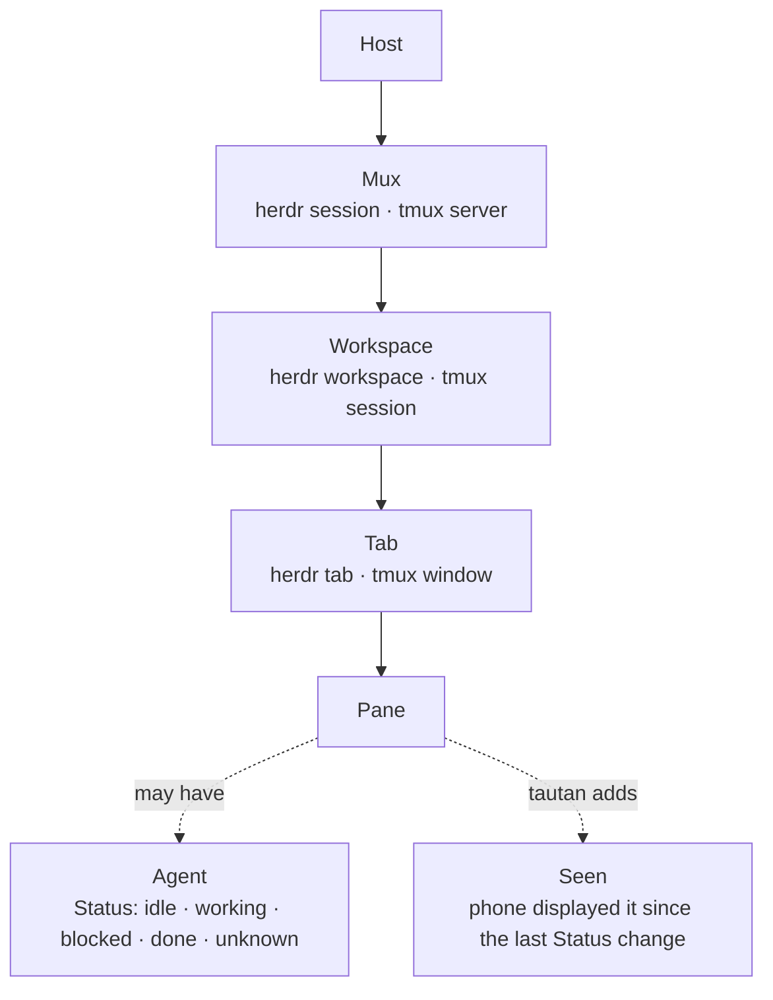
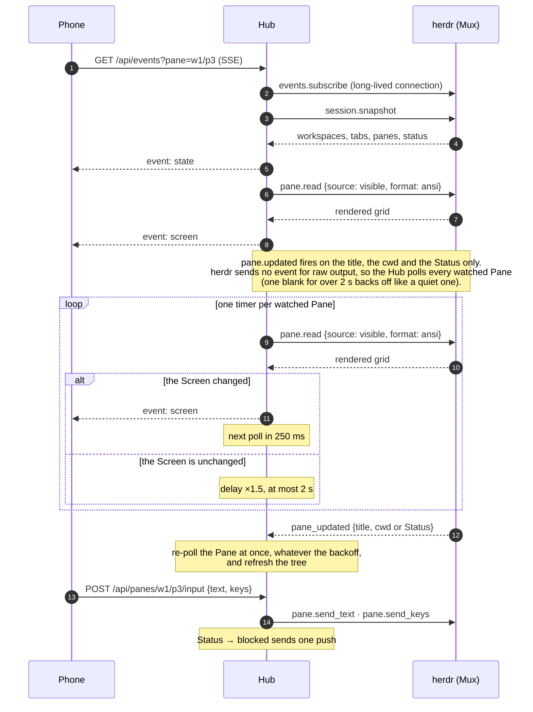
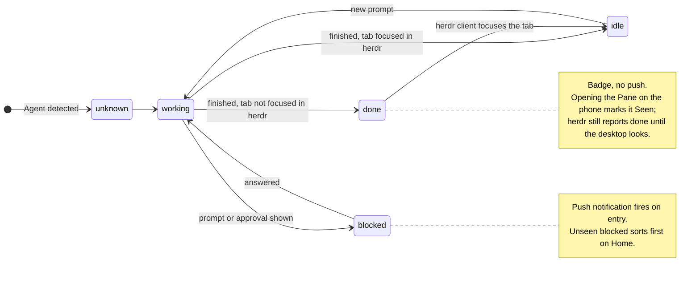
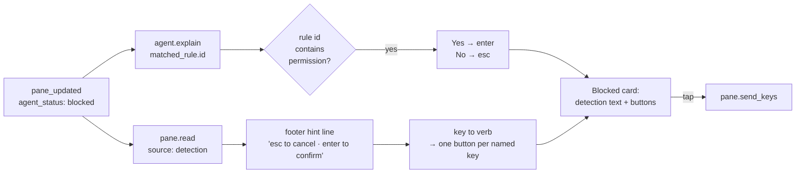

# Architecture

tautan is a **Hub** (a Bun process) plus a **PWA**. The Hub talks to multiplexers; the PWA
talks only to the Hub. Vocabulary is in [../CONTEXT.md](../CONTEXT.md).

One **Hub** per always-on Host. Remote Hosts need only `sshd` and the multiplexer; the Hub
uses the Hub user's own SSH configuration. The phone has one origin, one service worker,
one push subscription.

**Remote Hosts change nothing above the socket.** For each remote herdr Mux the Hub runs one
`ssh -L <local>.sock:<remote>.sock` forwarder and points `HerdrMux` at the forwarded local
socket; the adapter dials a unix socket either way and does not know which Host it reached.
Remote tmux is the same idea over a ControlMaster connection, so `tmux -S` runs on the other
side with one TCP handshake, not one per command. Everything above — the Mux registry, the
state projection, Seen, SSE, push — is unchanged.

### What the phone sees

Home flattens this to one list of Panes grouped by Workspace, unseen `blocked` first.

### How a screen stays live

## Facts the design depends on

- herdr has no network surface. Its only IPC is newline-delimited JSON over a unix socket
  (`~/.config/herdr/herdr.sock`; other sessions via `herdr session list --json`). The
  server closes the connection after **one** response, so the client opens a connection per
  request. Only `events.subscribe` stays open.
- `pane.updated` fires on the title, the cwd and the Status only — never on raw output. A
  shell that prints for ten seconds emits nothing, so the Hub polls a watched Pane instead.
  There is no replay: subscribe, then take a `session.snapshot`.
- `pane.read` returns the rendered grid (`format: ansi`) or text; sources `visible`,
  `recent`, `recent_unwrapped`, `detection`. No cursor position.
- `agent.explain` returns the matched detection rule (`matched_rule.id`) and evidence;
  `pane.read` with `source: detection` returns the region herdr classified, footer hints
  included. tautan builds tap-to-answer buttons from these; it has no per-agent grammars.
- tmux: `list-panes -a -F`, `capture-pane -e -p`, `send-keys -l`. Output does arrive as
  events: the Hub keeps one `tmux -C attach -E -r` control client per Workspace with a
  Pane watched in the last 30 s, feeds `%output` notifications into a dirty set and sweeps
  one capture per screen interval; with no control client (a remote Host spawns none) a
  fallback poll runs at five times the interval. A read is one process:
  `display-message -p '#{alternate_on}'` chained with `capture-pane` by `;`, so the
  alternate-screen flag and the grid come from the same instant. A control client that
  dies is probed with `list-clients` and restarts on a 1 s → 30 s backoff.
- herdr's Workspace snapshot carries no `cwd`. The Hub takes `worktree.checkout_path`
  when the Workspace is a worktree (herdr 0.9) and falls back to the first Pane's cwd.

### Status and Seen

Status comes from the Mux. Seen is tautan's own layer on top; it decides sort order and badges.

### Blocked → tap-to-answer

tautan writes no prompt grammars. herdr classifies the screen; tautan turns that into buttons.

Digits become buttons only when the footer names them; a numbered list is answered with the
arrow keys and Enter, which every prompt announces.

## Backend interface

One interface, two implementations (`shared/types.ts`, `Mux`). herdr implements everything;
tmux implements list, read, send and throws `unsupported` for the rest. There are no
capability flags: the UI hides write actions when `kind === 'tmux'`.

## Hub (`server/mux.ts`)

- Registry of Muxes keyed `<hostId>/<muxId>`; Panes keyed `<hostId>/<muxId>/<paneId>`.
- Any change from an adapter → 200 ms debounce → `tree()` → Status diff → SSE `state`
  (throttled to 2/s).
- Every Mux also refreshes its snapshot every 15 s (`new Hub({refreshMs})`, `0` disables
  it). It is a safety net: herdr sends no event when a pane stops producing output, so a
  Status that settles into `blocked` between events would otherwise arrive late.
- A Status **transition** into `blocked` sends one push per subscription. A Pane that is
  already `blocked` sends nothing, and `done` never pushes — it is a badge.
- Each SSE client may watch up to 4 Panes (ADR 0006): every watched Pane is polled on its
  own backoff, 250 ms after a change, ×1.5 while quiet, at most 2 s. A Screen blank for
  over 2 s backs off the same way, so an empty Pane stops costing four reads a second,
  and a `pane.updated` re-reads at once whatever the backoff. A changed Screen goes out as
  one SSE `screen` event, which names its Pane by `key`. tmux Panes are swept by the
  control client instead of polled one by one.
- A transcript that moves sends one SSE `chat` event, and only to the streams watching
  that Pane ([ADR 0007](./adr/0007-chat-deltas.md)); the Chat view then asks
  `/chat?since=` for what changed, so the history never rides the event.
- **Seen** is `{paneKey: revision}` persisted in `state.json`; unseen = `revision > seen`.
- `StatePane.command` is the Pane's foreground command name, which picks the App profile on
  the phone: tmux reads `pane_current_command`, herdr answers `pane.process_info` through
  `HerdrMux.foregroundCommand`. It is read with the last line, once per revision, and cached
  with it, because `foreground_processes` is a per-Pane call.
- The Hub never calls any `*.focus` method.

## HTTP API (`server/http.ts`)

| Route | Purpose |
|---|---|
| `GET /api/state` | hosts, muxes, workspaces, panes (with status, revision, seenRevision, preview, and the cell origin `x`/`y` in cells relative to the Tab — omitted for every Pane of a zoomed Tab) |
| `GET /api/events?pane=<key>&pane=<key>…` | SSE: `hello {stream}` first, then `state`, `screen`, `chat`; comment ping every 25 s. `pane=` repeats, de-duplicated, up to 4 watched Panes ([ADR 0006](./adr/0006-split-panes-mirror-mux-geometry.md)); a fifth key is 400 `{error: 'too-many-panes'}`, a key that resolves to no Pane drops, and none resolving is 404 `{error: 'pane not found'}`. Each watched Pane is polled on its own backoff (250 ms after a change, ×1.5 while quiet, at most 2 s). The `screen` event is unchanged: it names its Pane by `key`; a `chat` event wakes the Chat view of a watched Pane whose transcript moved ([ADR 0007](./adr/0007-chat-deltas.md)) |
| `GET /api/panes/:key/screen?mode=visible\|recent` | one Screen |
| `POST /api/panes/:key/input` `{text?, keys?, raw?}` | text first, then keys, then `raw` — bytes written to the pty untouched |
| `POST /api/panes/:key/mouse` `{kind, col, row, allow}` | `kind` is `click\|right\|double\|wheelUp\|wheelDown`, `col`/`row` are 1-based cells; the Hub builds the SGR press and release (`mouseBytes`) and sends them as `raw` → 204. 400 `{error: 'body'}` on an unknown kind or a coordinate outside 1…9999, 409 `{error: 'mouse-off'}` unless `allow` is true |
| `POST /api/panes/:key/lease` `{cols, rows, takeover?, stream?}` | take the Phone width geometry lease (ADR 0004): the Pane draws at these cells. `stream` is the id the stream's first `hello` event announced; the lease belongs to that stream and releases when it ends, whoever else watches the Pane (ADR 0006). Without `stream` the lease lives while any listener watches. 400 `{error: 'geometry'}` outside cols 10–500 or rows 4–200, 409 `{error: 'slot-held'}`, 501 `{error: 'not-herdr'}` on tmux → 204 |
| `DELETE /api/panes/:key/lease` | release the lease and restore the operator's geometry → 204 |
| `POST /api/panes/:key/seen` `{revision}` | mark Seen |
| `GET /api/panes/:key/explain` | Explain or null |
| `POST /api/panes/:key/attach` (raw body, `X-Name: <filename>`) | write the file on the Pane's Host → `{path, bytes, display}`; 413 over `TAUTAN_MAX_ATTACHMENT_MB` |
| `GET /api/workspaces/:key/diff?scope=working\|staged\|base[&file=<path>]` | run `git diff --no-color -U3` in the Workspace cwd, local or over SSH, and parse it with `shared/diff.ts` → `DiffResult`. `base` resolves `review.base` → upstream → `origin/HEAD` → main/master. Over 64 KB the file list is cut and `truncated` is true; `file=` returns that one file uncapped. 400 `{error: 'scope'}`, 404 `{error: 'unknown-workspace'}`, 409 `{error: 'not-a-repo'}`, 502 `{error: <git error>}` |
| `GET /api/panes/:key/chat[?agent=<subagent>]` | the parsed transcript → `ChatResponse`, ETag/304 and gzip; herdr only (501 on tmux). Resolution never guesses: herdr's `agent_session`, or the Pane's own `claude --resume` / Codex thread / `pi --session <uuid>` descriptor, the pi id resolved by a cached directory scan; anything unresolved is 404 `{error: 'no-session'}` and the Pane keeps its Screen ([ADR 0005](./adr/0005-chat-lens-second-view.md)) |
| `GET /api/panes/:key/chat?since=<cursor>[&limit=1–500][&after=<nativeId>]` | what changed since the cursor → `chats.delta` (`{cursor, reset, upserts}`), always 200 ([ADR 0007](./adr/0007-chat-deltas.md)): `limit` windows a reset to the newest turns, `after` names the client's oldest held Turn. `?before=<nativeId>&limit=` answers the earlier page in the same shape. `limit` without `since`/`before` is 400 `{error: 'limit'}`, `since` with `before` is 400, an id that is not a native turn id is 400 |
| `GET /api/panes/:key/chat/image/:id` | one pasted or Read image by numeric id → the bytes with the media type the transcript carried |
| `GET /api/panes/:key/chat/output/:toolId?part=result\|detail` | a tool's whole output (`result`) or whole input (`detail`) past the slice the turns carry; `toolId` is the tool's native id, `..` rejected |
| `GET /api/panes/:key/chat/preview/:id` | HTML the Agent wrote, served from disk behind realpath containment; the frame is `sandbox`ed without `allow-scripts` or `allow-same-origin`, and a source past the inline limit serves by id |
| `GET /api/panes/:key/file?path=` | one file read inside the Pane cwd (realpath containment): an image or UTF-8 text to `TAUTAN_MAX_FILE_MB` (5 MB), for the file viewer |
| `GET /api/files/list?host=&path=[&pane=][&q=][&hidden=1]` | a folder listing for the browser and the pickers, directories first; remote Hosts over the existing ssh path |
| `GET /api/files/raw?host=&path=[&pane=][&download=1]` | stream a file with `Range` support, `content-type` by extension, `content-disposition: attachment` when asked |
| `GET /api/panes/:key/complete?kind=slash\|file\|model&q=[&limit=]` | completion items for the composer: the Agent's commands (built-ins, `.claude/commands` and skills for Claude Code; pi its own list), files under the Pane cwd (git-ignored excluded), or models (`pi --list-models`, cached) |
| `GET /api/settings/quota` | the `quota-axi --json` report behind the usage meters, cached 5 min |
| `POST /api/muxes/:key/tabs` `{workspaceId, cwd?, label?, agent?}` | new Tab with one Pane, agent started when asked → 201 `{paneKey}` |
| `POST /api/muxes/:key/workspaces` `{cwd?, label?, branch?}` | new Workspace; `branch` makes it a git worktree → 201 `{workspaceKey}` |
| `POST /api/rename` `{muxKey, label, workspaceId\|tabId\|paneId}` | rename one of the three → 204 |
| `POST /api/panes/:key/close` | close the Pane → 204 |
| `POST /api/panes/:key/zoom` | `{zoomed}`: `true` zooms this Pane to fill its Tab, `false` unzooms its Tab → 204; herdr and tmux; the zoomed Pane carries `zoomed: true` in state |
| `POST /api/panes/:key/split` `{direction, ratio?, cwd?}` | split the Pane right or down at `ratio` (the new Pane's share) → 201 `{paneKey}` ([ADR 0008](./adr/0008-layout-editing.md)) |
| `POST /api/panes/:key/swap` `{target}` | trade places with another Pane of the same Tab → 204 |
| `POST /api/panes/:key/move` `{tab? \| newTab? \| newWorkspace?, split?}` | move the Pane; exactly one of the three destinations → 201 `{paneKey, workspaceKey?}` |
| `POST /api/panes/:key/resize` `{direction, amount}` | grow the Pane by `amount` cells (1–500) → 204 |
| `GET /api/push/vapid` | the Hub's VAPID public key, base64url |
| `POST /api/push/subscribe` (a `PushSubscription` as JSON) | store the subscription |
| `DELETE /api/push/subscribe` `{endpoint}` | forget it |
| `POST /api/hosts/probe` `{target, session?}` | dial a target once and save nothing → `{online, sessions?, error?}`; 400 `{error: 'target'}` for a target that is not `user@host` |
| `POST /api/hosts/:id/retry` | re-dial one Host, local or remote → the updated `StateHost`; the SSE `state` event is the receipt |
| `GET /api/settings` | trusted user, the login this request carries, what serves the app, `hosts.json`, and the Smart replies provider, model and flag |
| `PUT /api/settings` `{trustedUser?, hosts?}` | replace either; an omitted key is left alone, `trustedUser: null` unlocks → the new `Settings` |
| `POST /api/settings/suggest` `{enabled}` | turn Smart replies on or off on the Hub; the Hub persists the flag |
| `POST /api/panes/:key/suggest` | draft Smart replies for this Pane now → the StatePane; needs `TAUTAN_SUGGEST`; no-op while the Hub flag is off or a request for that revision is already in flight |

The write routes answer `{error}` with 400 (empty or over-80-character label, `cwd`
not absolute), 403 (Origin), 404 (unknown Mux, Workspace or Pane), 501 `unsupported`
(tmux cannot create, rename or close; herdr before 0.9 answers it for the layout writes)
and 502 with herdr's own error code, for example
`agent_not_ready`. The Hub refreshes State after a write, so the SSE `state` event is the
receipt.

The Hub encrypts each payload itself (RFC 8291, aes128gcm) and signs the request (RFC
8292, VAPID) with WebCrypto in `server/push.ts`; there is no `web-push` dependency. A push
service that answers 404 or 410 has its subscription dropped from `state.json`.

Auth: the Hub binds to loopback and expects `tailscale serve` in front. Every non-GET
request must carry an `Origin` whose host equals the `Host` header. If a trusted login is
configured, the `Tailscale-User-Login` header must match, or the request is 403
`{error: 'login'}`. `PUT /api/settings` may only lock the Hub to the login that request
itself carries; any other value is 400 `{error: 'login'}`, so one phone cannot lock a Hub to
somebody else's identity.

## Web app (`web/`)

Hash router, one `EventSource`, no state library. Screens: **Home** (flat Pane list grouped
by Workspace, unseen `blocked` first), **Pane** (grid of spans from `shared/ansi.ts`, key
bar, composer with mic, attach and completion), the **Chat lens** and the **file viewer**
on their own routes, **Settings**. `web/push.ts` owns the subscription and the app badge;
`web/public/sw.js` shows the notification, routes the tap and caches the shell, and
`vite.config.ts` stamps the built file list into it. The mock fixtures load as their own
chunk behind `?mock`, so the real bundle never carries them. Themes are `data-theme`
values on `<html>`: System, Light, Dark and the named palettes in `web/palettes.ts`, each
laid over the Halaska Kit tokens by `applyTheme()` with the palette's own 16 ANSI colours
inline. Every read and write of local state goes through `web/store.tsx`, the one door to
`localStorage`; a blocked store falls back to memory for the page's life and raises one
notice.

## Files on the Hub

| Path | Content |
|---|---|
| `$XDG_CONFIG_HOME/tautan/hosts.json` | an array of `HostConfig` (`{id, label?, target, session?, herdr?, tmux?}`), written whole by `PUT /api/settings {hosts}` from the Hosts screen |
| `$XDG_STATE_HOME/tautan/state.json` | `seen`, `vapid: {publicKey, privateKey}`, `subscriptions: [...]`, `trustedUser` |
| `$XDG_CACHE_HOME/tautan/` | `attachments/<unix-ms>-<name>` |
| `$XDG_RUNTIME_DIR/tautan/` | one forwarded socket per remote Mux, `<hostId>-<session>.sock`, beside its `cm-*` ControlMaster socket. With no `XDG_RUNTIME_DIR` the directory is `/tmp/tautan-<uid>`; either way it is mode 0700, because a unix socket a second user can open is a second user on the Mux |

### In the container

The image sets the four XDG variables to directories under one volume, so everything the Hub
writes lands in `/data`:

| Container path | XDG variable | Content |
|---|---|---|
| `/data/config/tautan/hosts.json` | `XDG_CONFIG_HOME=/data/config` | the `HostConfig` array |
| `/data/state/tautan/state.json` | `XDG_STATE_HOME=/data/state` | `seen`, the VAPID pair, `subscriptions`, `trustedUser` |
| `/data/cache/tautan/attachments/` | `XDG_CACHE_HOME=/data/cache` | uploaded files, never pruned |
| `/data/run/tautan/` | `XDG_RUNTIME_DIR=/data/run` | forwarded sockets and ControlMaster sockets |

Two paths come from the host instead, both read-only: the herdr configuration directory at
`/herdr` (`HERDR_SOCKET_PATH=/herdr/herdr.sock` points the Hub at the socket in it) and the
Hub user's SSH directory at `/home/tautan/.ssh`. The container runs as uid 1000, which must
be the uid that owns the herdr socket, because socket file permissions are the only boundary
there.

`/data/run` is a volume, not a tmpfs, so a forwarded socket can outlive a restart. The Hub
recreates the directory at mode 0700 and re-dials each Host on start, so a stale socket file
is replaced, not reused.

## Environment

| Variable | Default | What |
|---|---|---|
| `TAUTAN_PORT` | `7700` | the port the Hub listens on |
| `TAUTAN_BIND` | `127.0.0.1` | the interface it binds; leave it on loopback |
| `TAUTAN_MAX_ATTACHMENT_MB` | `200` | the cap on one upload |
| `TAUTAN_MAX_FILE_MB` | `5` | the cap on one file the viewer reads through `/api/panes/:key/file` |
| `TAUTAN_SUGGEST` | `off` | Smart replies provider: `off`, `zai` or `anthropic` |
| `TAUTAN_SUGGEST_KEY` | — | the provider key. Without it, `zai` reads `ZAI_API_KEY` then `~/.config/zai/api-key`, and `anthropic` reads `ANTHROPIC_API_KEY` |
| `TAUTAN_SUGGEST_MODEL` | `glm-5.3` for `zai`, `claude-haiku-5-5` for `anthropic` | the model that drafts the replies |
| `TAUTAN_SUGGEST_BASE` | `https://api.z.ai/api/anthropic`, `https://api.anthropic.com` | the API base, for a proxy or a self-hosted gateway |

## Smart replies

With `TAUTAN_SUGGEST` set, the Hub asks a small model for up to three one-line
replies whenever an agent Pane enters `blocked` or `done`, and puts them on
`StatePane.suggestions`. One call per Status change, cached by revision, from the
last 40 non-empty lines of the Screen. `POST /api/settings/suggest` is the
runtime switch and `POST /api/panes/:key/suggest` forces a fresh draft. The phone
has its own switch and shows the drafts only when both are on; what leaves the Hub
is in [SECURITY.md](./SECURITY.md).
