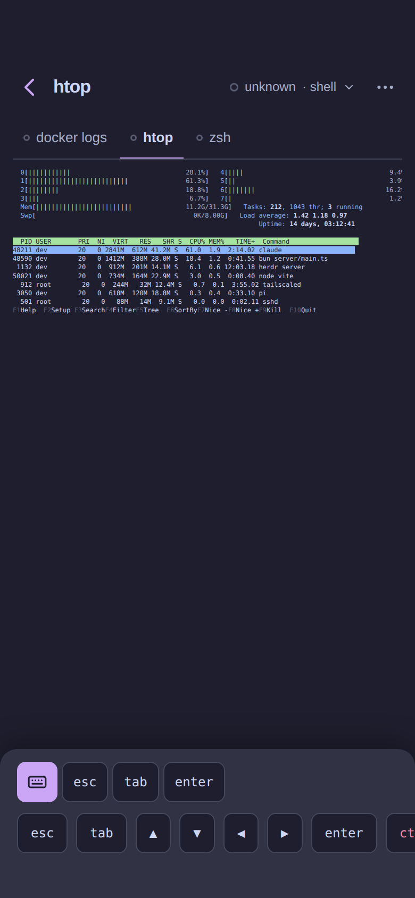

# Design direction

What tautan should look like and why. The research behind each call is in [UX.md](./UX.md);
the settled product decisions are in [DECISIONS.md](./DECISIONS.md). The mockups are a
design canvas you can edit: **[tautan Screens](https://claude.ai/code/artifact/ee67305a-ece1-4d62-b0b7-e866752a7030)**
(source under [design/src/](./design/src/), exports under [design/](./design/)).

## In one paragraph

Linear and Notion density on a phone: one accent, three surfaces, no boxed cards, 56 px
two-line rows, small-caps section labels. Status is a dot; filled means unseen, a hollow ring
means seen. The urgent list ("Needs you") and a "Running" list are pinned above the Workspace
groups. A Pane is a
full-screen push with the multiplexer's own rendered grid, a sticky blocked card built from
herdr's detection, a key bar ordered by real use, and a composer labelled with the agent's
glyph. A floating tab bar carries the three root destinations and hides while you type.

## Screens

| Screen | Mockup | What it shows |
|---|---|---|
| Agents · Mocha |  | Needs-you section, collapsible Workspace groups with Host suffix and a summary when collapsed, offline Host row, floating tab bar with badge |
| Pane · Claude blocked |  | Top bar, Home's geometry: back and title on the left; the status chip that opens Switch, read aloud and ⋯ on the right. Tab strip under it: + then the Tabs, and the open Tab's Panes on a second row under the section's hairline. Grid with right-edge fade. Blocked card floating above the dock. Bottom dock: the keys toggle then the inline keys on the left, quick replies scrolling on the right, then the composer |
| Pane · shell |  | htop with Fit on, same top bar and Tab strip (tmux, so no +), the key bar expanded by default in the dock, no composer |
| Hosts |  | One card per Host: state, Muxes with Pane counts, error with Retry, Add Host |
| Switch drawer |  | From any Pane: search, Host chips, every Workspace with its Panes under their Tab labels. Two taps to any Pane on any Host |
| Settings |  | Theme chips, Hosts summary, push and haptics toggles, iOS install hint, access rows |
| Agents · Latte |  | Same structure in the light Catppuccin theme, with the corrected muted color |
| New Tab drawer |  | Drawer (vaul) with label, directory, agent chips, one primary action |

## Pane top bar and bottom dock

The Pane screen is one column: two bars, a grid between them, and the dock. Everything on the
screen shares that column's width, so nothing stretches to the window.

| Bar | Contents | Behaviour |
|---|---|---|
| Column | One wrapper for the whole screen. From `lg` up its width is `clamp(420px, <grid width + 34px>, 100vw)`, where the grid width is the widest `<pre>` measured in this Workspace; below `lg` it is the window | The header, the Tab strip, the grid, the blocked card and the dock all sit in it and are centred together. Every Pane of a Workspace shares the width, so a Tab or Pane switch never moves the column; entering another Workspace eases `max-width` over 180 ms |
| Top bar | Home's `TopBar` in its `compact` size: the same 56 px row + safe area, 16 px sides, 44 px icon targets, `--bg` at 90 % with blur. Home's grammar: title left, muted meta and actions right. Left: back chevron (accent) · title. Right: the status chip "● status · agent ⌄" (12 px muted, the Status word in its colour; the whole chip opens Switch) · read aloud (agent Panes) · ⋯. The title is 17 px, Home's compact size, not the 26 px rest size, because a Pane title is a sentence and has to share the row. The chip keeps its own width up to 45 % of the row, then its agent name truncates; the title takes the rest and truncates. No scroll shrink: the grid scrolls in its own box | The bar carries no setting of its own: ⋯ holds the theme chips, then Wrap, Fit to width (hinted with the grid size), Theme colors, Diff, Rename, Close Pane |
| Tab strip | One section of two rows under the top bar. Row 1: **+** for a new Tab (herdr only), then one tab per Tab of the Workspace with status dot, label and Pane count when the Tab holds several; the active tab is underlined in accent on the section's hairline. Row 2: the Panes of the open Tab, as pills, only when it holds several; it hangs on that same hairline and starts where the Tab labels do, not under the + | Tap switches Tab; swipe on the strip too |
| Blocked card | floats above the dock, `--elevated`, 1 px hairline | Only while Status is `blocked` |
| Bottom dock | `--elevated`, 16 px top radius. Row 1: the keys toggle, filled (`--surface` and the hairline, accent while open), then the most-used keys, then a hairline, the quick-reply pills scrolling on the right behind a fade. Row 2: the whole key preset, which the toggle opens. Row 3: the composer, on agent Panes, with the agent's glyph inside the field | Key pills (Yes ↵, No esc) send at once; text pills (✦ generated, or static per agent) fill the composer for review. A Hint pill is a short label and the key's glyph — `auto mode ⇧⇥`, `cancel esc` — never the whole footer phrase. The key bar starts collapsed on an agent Pane, where the composer is what the keyboard should meet, and open on a shell Pane, which has nothing else |

## Creating things

| Action | Where | Result |
|---|---|---|
| New Workspace | + in the Agents header → New Workspace drawer (directory, label, worktree branch) | herdr `workspace.create` / `worktree.create` |
| New Tab | + at the start of the Pane's Tab strip, or long-press a Workspace header → New Tab drawer (label, directory, start agent) | herdr `tab.create` makes the Tab with one root Pane; the drawer optionally starts an agent in it |
| Rename, Close | ⋯ in the Pane top bar; long-press a row on the Agents screen | Drawer / Dialog |

A Tab is never its own screen: on the phone it is an entry in the Pane's Tab strip and a label
in the Switch drawer. A Tab with one Pane opens straight to that Pane.

## Switching at every level

| Between | Where | How |
|---|---|---|
| Hosts | Agents tab: Host chips under the header filter the list. Hosts tab: cards | tap |
| Workspaces | Agents tab: collapsible groups, state remembered. From a Pane: tap the status chip in the top bar to open the Switch drawer | tap |
| Tabs | The Tab strip under the Pane's top bar; the Switch drawer shows the same grouping | tap tab, swipe |
| Agents and shells | Tabs in the strip's first row; the open Tab's Pane pills in its second; swipe on the strip (never on the grid) | tap, swipe |

Motion follows the kind of screen, not the route. Home ↔ Pane is a push (the View Transition
in `navigate()`), in both directions. Pane → Pane from the Tab strip, a Pane pill, the Switch
drawer or a swipe, and Diff ↔ Pane, swap the content in place with no transition: the top bar,
the Tab strip, the pills and the dock stay mounted and still, and only their contents change.
The grid keeps the last Pane's Screen until the new Pane's first `screen` event replaces it, and
shows the skeleton only when nothing arrives within 800 ms. Reduced motion turns off the push
and the column's width easing alike.

## Terminal width on a phone

The grid is what the multiplexer rendered at the server's size. Four answers, in order:

0. **Give the grid the column** (v1): from `lg` up the column is the grid's own measured width plus the scroller's padding, centred, so a desktop shows the whole grid and scales nothing. A phone is narrower than any grid, so the next two answers are for the phone.
1. **Wrap** (v1): the same grid text reflowed to the phone width, client-side. Reading mode for agent output. Replaces the earlier Screen/Recent idea: Claude Code runs on the alternate screen, so herdr's "recent" returns the same rows as the visible grid.
2. **Fit** (v1): scale the grid to the phone width with exact metrics; the toggle label shows the grid size.
3. **Resize to phone is not possible today:** herdr 0.9 exposes rendered Screen reads and shared split-ratio resizing, but no API for exact columns/rows or a separately sized client surface; a client viewing the same Tab can change the desktop's Pane sizes. Keep Wrap and Fit. A future Resize action must be explicit, warn that it changes the shared desktop layout, record the old geometry, and restore it on leaving.

## Rules the mockups follow

| Rule | Value |
|---|---|
| Row | 56 px two-line; 44 px one-line; 12 px vertical, 16 px horizontal padding |
| Line 1 | agent name in `--muted`, title in `--fg`; unseen rows `font-weight: 500` |
| Line 2 | blocked reason → last non-empty screen line → `basename(cwd)`; status word printed for `blocked` and `done` |
| Right column | time since the last Status change, 12 px, tabular numerals |
| Dot | 8 px; filled = unseen, 1.5 px ring = seen; `--warn` blocked, `--ok` done, `--accent` working, `--muted` idle, `--danger` offline |
| Section label | 11 px, 600, +0.08 em, uppercase, `--muted`; 24 px above, 4 px below |
| Tab bar | Agents · Hosts · Settings; 52 px + safe area, inset 12 px, 14 px radius, `--elevated` at 88 %, blur, hairline; badge = unseen blocked count |
| Surfaces | `--bg` page · `--surface` inset controls (composer, key caps, chips) · `--elevated` raised (tab bar, blocked card, drawers) |
| Accent | primary button, current chip or tab, `working`, focus ring. Nothing else |
| Radius | 8 px chips, buttons and key caps; 10 px composer; 12 px cards and the blocked card; 14 px tab bar; 16 px drawer top. Dots stay circles. No pills. The Pane column itself is never rounded and carries no border, at any width |
| Type | caption 12/1.35 · body 15/1.45 · title 17/1.25 600 · mono 12/1.35 |
| Grid | scrolled by default, right-edge fade while it overflows. The three reading options live in ⋯: Wrap reflows, Fit scales the `<pre>`, Theme colors snaps every 256-colour and truecolour span to the nearest of the theme's own 16 |
| Key bar | agent: `esc ▲ ▼ tab shift+tab enter ctrl+c`, inline `esc ▲ ▼ enter` · shell: `esc tab ▲ ▼ ◀ ▶ enter ctrl+c ctrl+d ctrl+l ctrl+r`, inline `esc tab enter`. One glyph map (`web/keys.ts`) spells a key for the caps and the pills alike: `▲ ▼ ◀ ▶`, `↵`, `⇥`, `⇧⇥`, `^d` |
| Composer | the agent's glyph inside the field, placeholder in the agent's voice, mic replaces send while empty |
| Blocked card | sticky above the key bar, `--elevated`, title + rule id, one-line detection excerpt, Yes/No preset then hint keys |
| Chrome left blank | status bar area (54 px) and the keyboard; the OS draws both |

## Per-theme surface values

| Theme | `--bg` | `--surface` | `--elevated` | `--muted` |
|---|---|---|---|---|
| light | `#ffffff` | `#f4f4f5` | `#ffffff` + shadow | `#71717a` |
| dark | `#0e0e11` | `#17171b` | `#1c1c21` | `#8b8b96` |
| latte | `#eff1f5` | `#e6e9ef` | `#ffffff` | `#5c5f77` (was `#6c6f85`, failed 4.5:1) |
| frappé | `#303446` | `#292c3c` | `#414559` | `#a5adce` |
| macchiato | `#24273a` | `#1e2030` | `#363a4f` | `#a5adcb` |
| mocha | `#1e1e2e` | `#181825` | `#313244` | `#a6adc8` |

## Open questions

1. Call a Workspace a "Space" in the UI? (herdr says workspace; tmux says session; the maintainer says space.)
2. Blocked card: open by default, or collapsed to one line until tapped?
3. Theme picker: chips (as mocked) or a full list with previews?

## How to update the mockups

Edit the files under `docs/design/src/`, then ask Claude to re-save the canvas, or edit the
canvas directly in the browser and press Save. Re-export the PNGs into `docs/design/` after
either.
